# HDSRNet
## Heterogeneous dynamic convolutional network in image super-resolution (HDSRNet) is conducted by Chunwei Tian, Xuanyu Zhang, Jia Ren, Wangmeng Zuo, Yanning Zhang and Chia-Wen Lin. It is implemented by Pytorch. 
## It is reported by famous wechat computer technique platforms of AIWalker (https://mp.weixin.qq.com/s/QNtvp6IcvfRrSaHJIelOFQ).
## Its orginal paper can be obtained by https://arxiv.org/pdf/2402.15704.pdf.

### Abstract
#### Convolutional neural networks can automatically learn features via deep network architectures and given input samples. However, robustness of obtained models may have challenges in varying scenes. In this paper, we present a heterogeneous dynamic convolutional network in image super-resolution (HDSRNet). To capture more information, HDSRNet is implemented by a heterogeneous parallel network. The upper network can facilitate more contexture information via stacked heterogeneous blocks to improve effects of image super-resolution. Each heterogeneous block is composed of a combination of a dilated, dynamic, common convolutional layers, ReLU and residual learning operation. It can not only adaptively adjust parameters, according to different inputs, but also prevent long-term dependency problem. The lower network utilizes a symmetric architecture to enhance relations of different layers to mine more structural information, which is complementary with upper network for image super-resolution. The relevant experimental results show that the proposed HDSRNet is effective to deal with image resolving.


## Requirements (Pytorch)  
#### Pytorch 1.13.1

#### Python 3.8

#### torchvision

#### openCv for Python

## Datasets
### Training dataset

#### The training dataset is downloaded at https://data.vision.ee.ethz.ch/cvl/DIV2K/

### Test datasets

#### The test dataset of Set5 is downloaded at 链接：https://pan.baidu.com/s/1YqoDHEb-03f-AhPIpEHDPQ (secret code：atwu) (baiduyun) or https://drive.google.com/file/d/1hlwSX0KSbj-V841eESlttoe9Ew7r-Iih/view?usp=sharing (google drive)

#### The test dataset of Set14 is downloaded at 链接：https://pan.baidu.com/s/1GnGD9elL0pxakS6XJmj4tA (secret code：vsks) (baiduyun) or https://drive.google.com/file/d/1us_0sLBFxFZe92wzIN-r79QZ9LINrxPf/view?usp=sharing (google drive)

#### The test dataset of B100 is downloaded at 链接：https://pan.baidu.com/s/1GV99jmj2wrEEAQFHSi8jWw （secret code：fhs2) (baiduyun) or https://drive.google.com/file/d/1G8FCPxPEVzaBcZ6B-w-7Mk8re2WwUZKl/view?usp=sharing (google drive)

#### The test dataset of Urban100 is downloaded at 链接：https://pan.baidu.com/s/15k55SkO6H6A7zHofgHk9fw (secret code：2hny) (baiduyun) or https://drive.google.com/file/d/1yArL2Wh79Hy2i7_YZ8y5mcdAkFTK5HOU/view?usp=sharing (google drive)

## Commands
### Training a model for single scale

#### x2
#### python main.py --model hdsrnet --scale 2  --data_test Urban100 --patch_size 128 --save ddycnnsr_x2_L1_900  --epochs 1200   --batch_size 64 --data_range 1-900 --pre_train ../checkpoint/HDSRNet_x2.pt --gclip 10.0
#### x3
#### python main.py --model hdsrnet --scale 3  --data_test Urban100 --patch_size 128 --save ddycnnsr_x3_L1_900  --epochs 1200   --batch_size 64 --data_range 1-900 --pre_train ../checkpoint/HDSRNet_x3.pt --gclip 10.0
#### x4
#### python main.py --model hdsrnet --scale 4  --data_test Urban100 --patch_size 128 --save ddycnnsr_x4_L1_900  --epochs 1200   --batch_size 64 --data_range 1-900 --pre_train ../checkpoint/HDSRNet_x4.pt --gclip 10.0

### Test with your own parameter setting in the option.py.
#### x2
#### python main.py --model hdsrnet --scale 2  --data_test Set5  --pre_train ../checkpoint/HDSRNet_x2.pt --test_only --save_results
#### x3
#### python main.py --model hdsrnet --scale 3  --data_test Set5  --pre_train ../checkpoint/HDSRNet_x3.pt --test_only --save_results
#### x4
#### python main.py --model hdsrnet --scale 4  --data_test Set5  --pre_train ../checkpoint/HDSRNet_x4.pt --test_only --save_results


## 1. Network architecture of HDSRNet

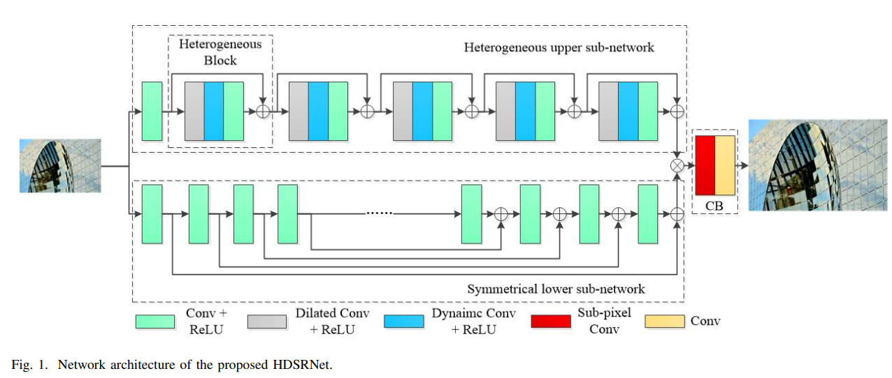

## 2. HDSRNet for x2，x3 and x4 on Set5

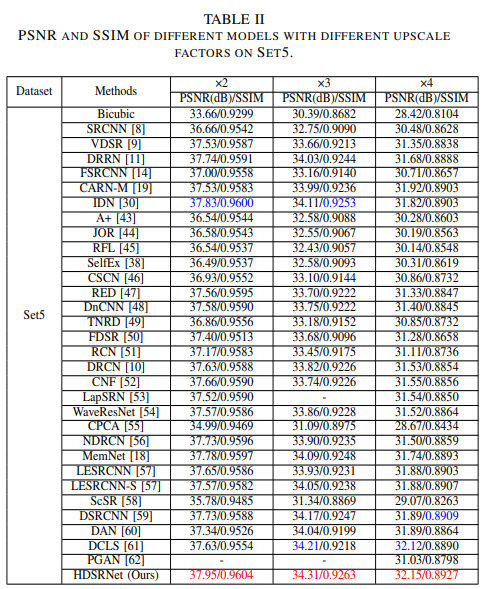

## 3. HDSRNet for x2，x3 and x4 on Set14

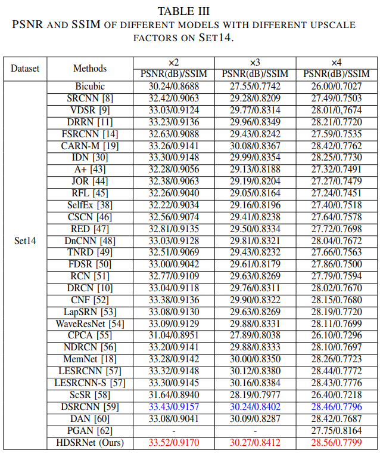

## 4. HDSRNet for x2，x3 and x4  on B100

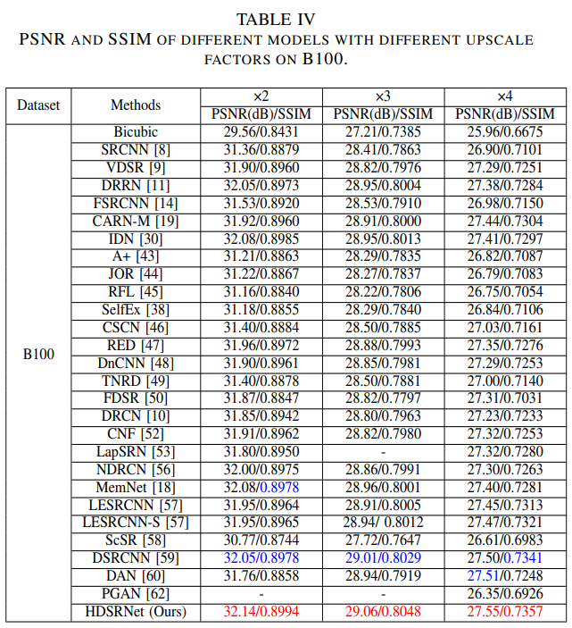

## 5. HDSRNet for x2，x3 and x4  on U100


## 6. Running time of different methods on hr images of size 256x256 and 512x512 for x4.


## 7. Complexities of different methods for x4.

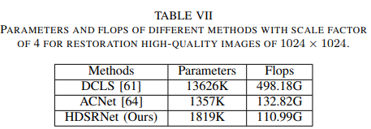

## 8. Visual results of Set14 for x2.

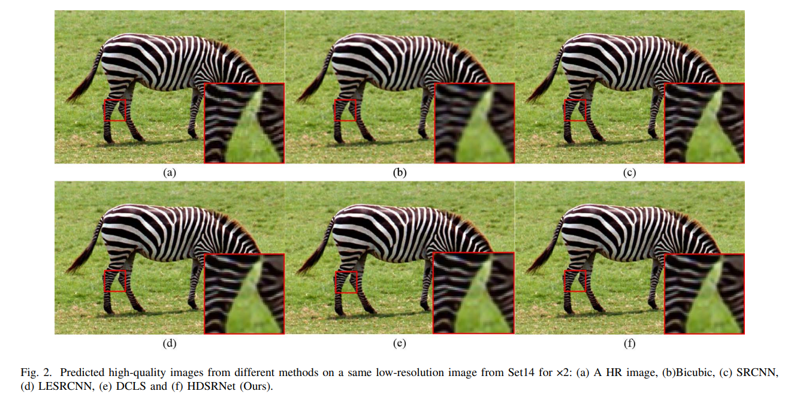

## 9. Visual results of B100 for x3.

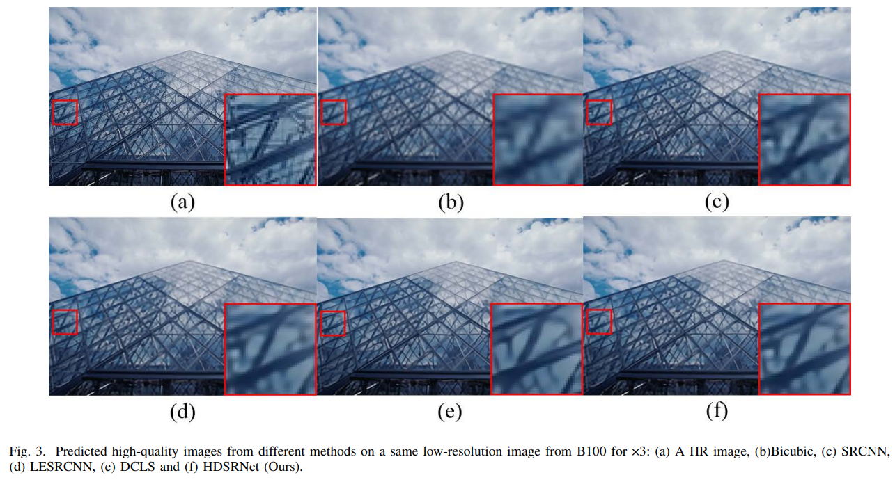

## 10. Visual results of B100 for x3.

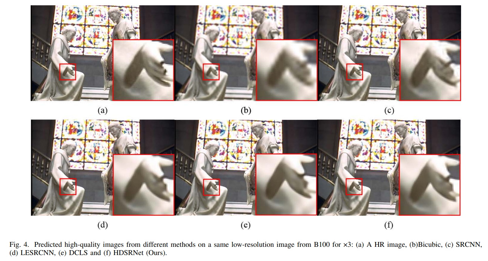

## 11. Visual results of U100 for x4.

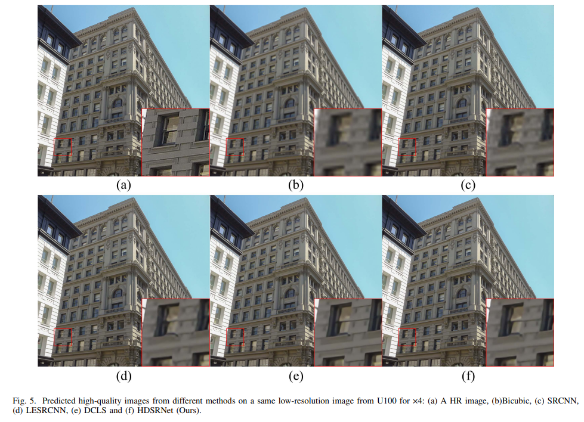

## 12. Visual results of U100 for x4.

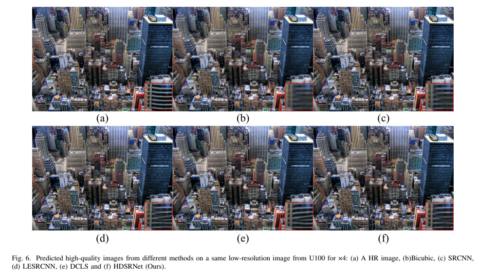

## 13. Visual results of U100 for x4.

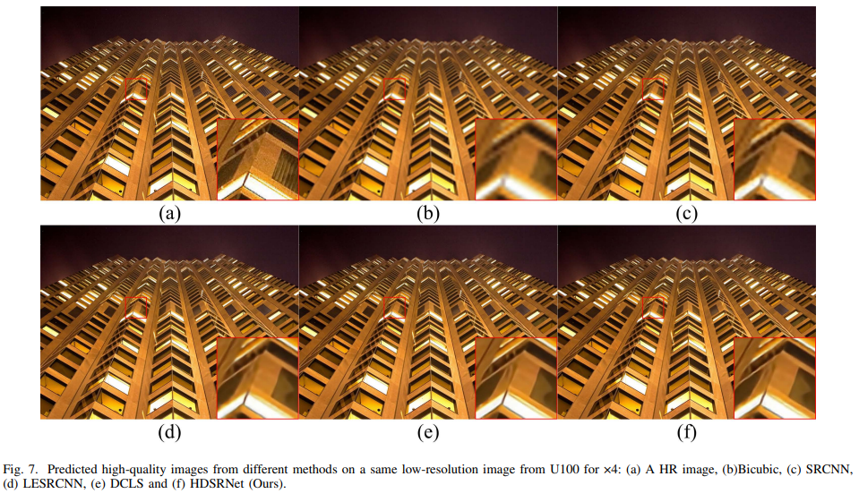

## If you cite this paper, please use the following format:

### 1. Tian, C., Zhang, X., Ren, J., Zuo, W., Zhang, Y., & Lin, C. W. (2024). A Heterogeneous Dynamic Convolutional Neural Network for Image Super-resolution. arXiv preprint arXiv:2402.15704.
### 2. BibTeX style format.
```BibTeX
@article{tian2024heterogeneous,
  title={A Heterogeneous Dynamic Convolutional Neural Network for Image Super-resolution},
  author={Tian, Chunwei and Zhang, Xuanyu and Ren, Jia and Zuo, Wangmeng and Zhang, Yanning and Lin, Chia-Wen},
  journal={arXiv preprint arXiv:2402.15704},
  year={2024}
}
```
